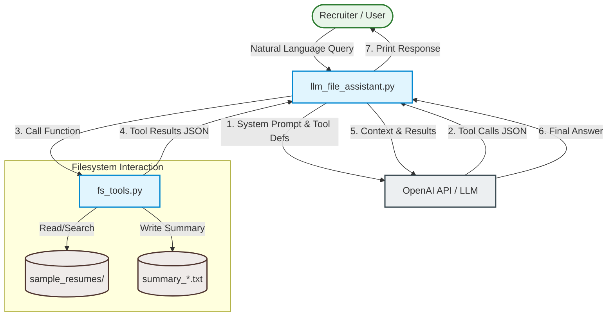

# LLM File System Assistant

## Overview

This repository demonstrates an LLM-enabled resume assistant built for recruiter and portfolio use cases. It combines reliable file I/O utilities with function-calling-driven prompt handling to search, inspect, and interact with candidate resumes stored locally.

## Core Capabilities

- Read `.txt`, `.pdf`, and `.docx` resume files and return structured content and metadata
- Recursively list files in a directory with extension filtering and file metadata
- Search resume content for keywords and return contextual matches
- Execute assistant queries through explicit tool functions to minimize hallucination

## Architecture

The following diagram illustrates the interaction flow between the User, the LLM agent coordinator, and the filesystem tools:



### `fs_tools.py`

`fs_tools.py` encapsulates file system utilities:

- `read_file(filepath)`
  - Parses `.txt`, `.pdf`, and `.docx`
  - Returns text content and metadata such as filename, absolute path, size, and modification time
- `list_files(directory, extension=None)`
  - Recursively enumerates files under a directory
  - Supports optional extension-based filtering
- `write_file(filepath, content)`
  - Writes UTF-8 text content, creating parent directories as needed
- `search_in_file(filepath, keyword, context_size=150, limit=10, offset=0)`
  - Searches file content for a keyword and returns positions plus surrounding context
  - Supports configurable `context_size` (default is 150 characters around the keyword)
  - Supports pagination via `limit` (default 10) and `offset` (default 0) parameters to prevent overwhelming output

### `llm_file_assistant.py`

`llm_file_assistant.py` implements the conversational assistant layer:

- Loads environment settings with `python-dotenv`
- Uses the OpenAI client with `LLM_API_KEY` and `LLM_API_URL` for custom endpoints
- Defines tool schemas for `list_files`, `read_file`, `write_file`, and `search_in_file` (with pagination support)
- Runs a multi-turn conversation loop with automatic tool execution
- Prints tool calls and arguments for debugging
- Enforces a system prompt with examples that prevents fabrication of filenames and paths

## Setup

You can set up the environment using either `uv` or standard Python build tools.

### Option A: Using `uv` (Recommended)

1. Create a virtual environment:
   ```bash
   uv venv .venv
   ```

2. Install dependencies:
   ```bash
   uv pip install -r requirements.txt
   ```

### Option B: Using Standard Python and Pip

1. Create a virtual environment:
   ```bash
   python3 -m venv .venv
   ```

2. Activate the virtual environment:
   - **macOS/Linux**:
     ```bash
     source .venv/bin/activate
     ```
   - **Windows**:
     ```cmd
     .venv\Scripts\activate
     ```

3. Install dependencies:
   ```bash
   pip install -r requirements.txt
   ```

### Environment Configuration

Add credentials to a `.env` file in the project root:

```env
LLM_API_KEY=your_api_key_here
LLM_API_URL=your_api_url_here
```

> `llm_file_assistant.py` reads the API key and URL from `LLM_API_KEY` and `LLM_API_URL` respectively.

## Usage

Run the assistant from the repository root:

**Using `uv`:**
```bash
uv run python llm_file_assistant.py
```

**Using Standard Python (with active virtual environment):**
```bash
python llm_file_assistant.py
```

At the prompt, enter recruiter-style commands or natural language queries. Use `exit` to terminate the session.

## Example Queries

- `Search resumes for Python`
- `Find resumes with SQL experience`
- `List all files in sample_resumes`
- `Read sample_resumes/john_doe.txt`

## Example End-to-End Run

Below is an example of running the assistant and querying it:

```bash
$ python llm_file_assistant.py
LLM File Assistant Started
Type 'exit' to quit.

User > Find resumes mentioning Python experience

Calling Tool: list_files
{'directory': 'sample_resumes'}

Calling Tool: search_in_file
{'filepath': '/Users/shashank/Dev/AI/llm_file_system_assistant/sample_resumes/alex_kumar.txt', 'keyword': 'Python'}

Calling Tool: search_in_file
{'filepath': '/Users/shashank/Dev/AI/llm_file_system_assistant/sample_resumes/emily_watson.docx', 'keyword': 'Python'}

...

Assistant Response:

The search for "Python" found matches in 2 out of 6 resumes:

1. ✅ **john_doe.txt**  
   Match context: `Python, FastAPI, AWS, Docker`  
   File path: `sample_resumes/john_doe.txt`

2. ✅ **emily_watson.docx**  
   Match context: `Skills: Python, Kubernetes, PostgreSQL`  
   File path: `sample_resumes/emily_watson.docx`

No matches found in:  
- michael_lee.pdf  
- alex_kumar.txt  
- shashank.txt  

---

User > summarize shashank.txt resume

Calling Tool: list_files
{'directory': 'sample_resumes/'}

Calling Tool: read_file
{'filepath': '/Users/shashank/Dev/AI/llm_file_system_assistant/sample_resumes/shashank.txt'}

Calling Tool: write_file
{'content': 'Shashank has 5+ years of experience as a backend engineer specializing in distributed systems. Key skills include Java, Spring Boot, Kafka, SQL, Python, GenAI, Cloud technologies, Docker, and Kubernetes. Proficient in building scalable backend solutions.', 'filepath': '/Users/shashank/Dev/AI/llm_file_system_assistant/sample_resumes/summary_shashank.txt'}

Assistant Response:

The summary for Shashank's resume has been successfully created and saved as `summary_shashank.txt`. Here's what was done:

1. **Original File**: `shashank.txt` contained:
   - Name: Shashank
   - Skills: Java, Spring Boot, Kafka, SQL, Python, GenAI, Cloud, Docker, Kubernetes
   - Experience: 5+ years as a backend engineer specializing in distributed systems

2. **Generated Summary**: 
   The summary condenses this into a concise professional profile while maintaining all technical keywords and experience highlights.

Would you like to review the summary content or need further modifications?
```

## Project Layout

```text
.
├── fs_tools.py
├── llm_file_assistant.py
├── requirements.txt
├── README.md
└── sample_resumes/
    ├── alex_kumar.txt
    ├── emily_watson.docx
    ├── john_doe.txt
    ├── michael_lee.pdf
    └── shashank.txt
```

## Notes

- Default resume source directory: `sample_resumes/`
- Supported resume formats: `.txt`, `.pdf`, `.docx`
- The assistant is designed to rely on tool output rather than free-form file generation
- `write_file` tool is available for creating summaries and output files
- Multi-turn conversations are supported—the assistant will make multiple tool calls as needed
